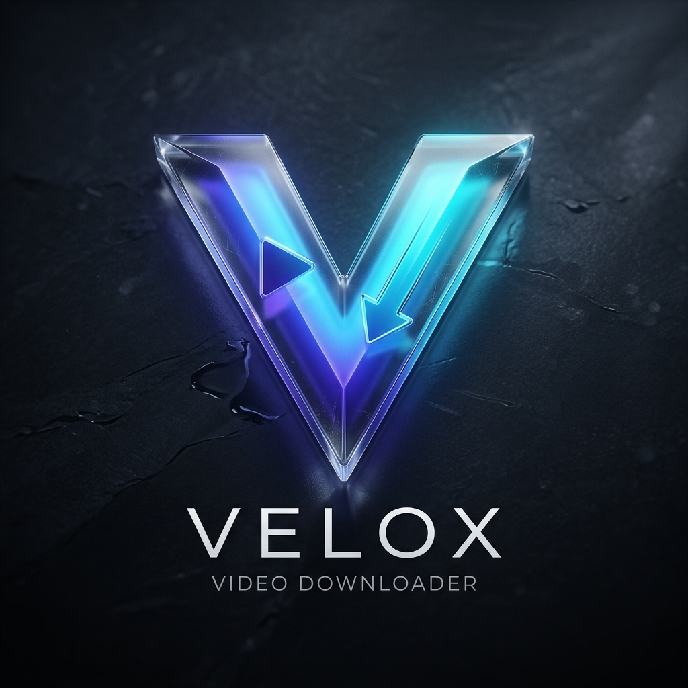

# 🚀 Velox: Premium Video Downloader



**Velox** is a high-fidelity, luxury-tier video downloader designed for users who demand speed, quality, and a world-class aesthetic. Built with Flutter and powered by the cutting-edge `yt-dlp` engine, Velox transforms the way you capture and organize your cinematic collection.

---

## ✨ Key Features

- 💎 **Liquid Glass UI**: A breathtaking, high-fidelity user interface with frosted crystal reflections and adaptive dark/light modes.
- 🚀 **Turbo Downloads**: Powered by `yt-dlp` for maximum speed and support for 4K, 8K, HDR, and High Frame Rate (60fps) content.
- 🛡️ **Private Vault**: Your downloads and history are stored locally on your device. No cloud tracking, no public feeds.
- 📐 **Flexible Library**: Switch instantly between a rich Poster Grid and a clean List view to manage your collection.
- 🎬 **Integrated Player**: Play your 4K/8K downloads natively with the high-performance `media_kit` MPV-based player.
- 🌍 **Universal Support**: Seamlessly extracts high-quality streams from YouTube and other major cinematic platforms.

---

## 🛠️ Tech Stack

- **Frontend**: Flutter (Dart) with Riverpod for elite state management.
- **Engine**: `yt-dlp` (Python-based powerhouse).
- **Media**: `media_kit` (MPV-based native playback).
- **Design**: Custom Glassmorphism System with Premium Pearl Slate and Royal Indigo themes.

---

## 📦 Installation & Setup

1. **Prerequisites**: Ensure you have [Flutter SDK](https://docs.flutter.dev/get-started/install) installed.
2. **Clone the Repo**:
   ```bash
   git clone https://github.com/YOUR_USERNAME/velox-downloader.git
   ```
3. **Install Dependencies**:
   ```bash
   flutter pub get
   ```
4. **Tool Configuration**:
   - Ensure `yt-dlp` and `ffmpeg` are installed and accessible on your system path (or update the paths in `lib/services/download_service.dart`).
5. **Run Velox**:
   ```bash
   flutter run
   ```

---

## 🔐 Privacy Policy

**Velox** is committed to absolute user privacy. All download tasks, metadata, and video files are stored strictly on the user's local machine. We do not collect, share, or monitor any user downloading habits.

---

## 🤝 Contributing

We welcome contributions from the community! Feel free to open issues or submit pull requests to help make Velox even more elite.

---

## 📄 License

This project is licensed under the MIT License - see the [LICENSE](LICENSE) file for details.

---

**Developed with ❤️ for the cinematic community.** 🥂🔥🎥
